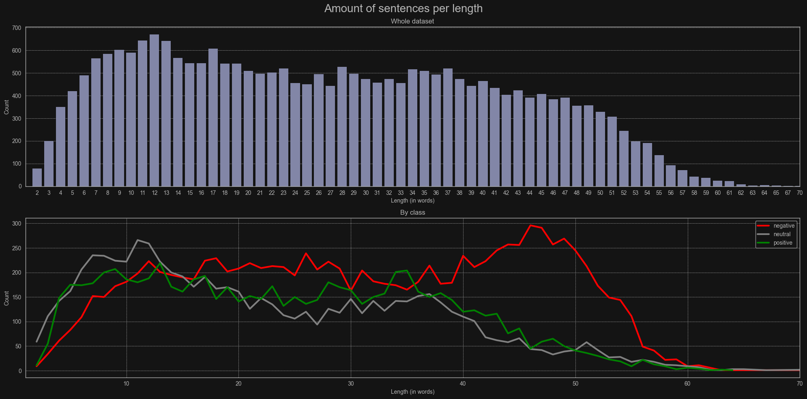
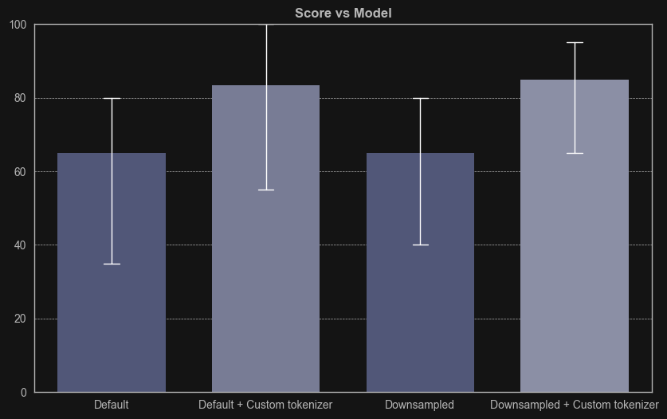

# {Introduction}
In this project I took a look at 'Twitter posts' dataset from Kaggle.  
The project is in jupyter notebook format (.ipynb) that shows the process of data analysis and building models.  
Main objective of this project is to compare different supervised learning methods to increase performance of AI classifying model.

### Libraries I've used:
- ***sklearn*** for machine learning
- ***pandas*** for data analysis
- ***numpy, scipy, random*** for numerical operations
- ***matplotlib, seaborn*** for plotting
- ***nltk, string, emoji*** for text processing

### The full process includes:
1) **Dataset overview**

2) **Processing text data**
   - Removing duplicates
   - Balancing the data
   - Length of sentences

3) **Creating the Model**
   - Class weighting
   - Text tokenizing
   - Training the model
   - Hyperparameter tuning
   - Testing in practice

4) **Conclusion**

# { Example features I extracted }

### Negative sentences length
After extracting length of each sentence I've noticed that red peak in negative subgroup.  
It's actual fact that people tend to write longer sentences for negative reviews.

# { Summary }

### Model comparison
The white vertical indicates the deviation from the average score, the smaller the line is the more class balanced predictions are. 
So we can clearly notice that the last model has the highest and most balanced score.

### What I achieved:
- I learned a lot about natural language processing
- An AI model that predicts sentiment from text with an accuracy of roughly 85%

### Significant improvement noticed after:
- Applying text tokenizing function
- Downsampling dataset to achieve more balanced class ratio

### Future ideas:
- Filter out certain head size
- Border box around predicted tumor localization
- Finish full web/desktop application

The custom tokenizer works way better in practice and actually has some kind of impact. 
I think that after more tweaking it has potential to be used in social media websites such as: Instagram, Twitter or YouTube.  
